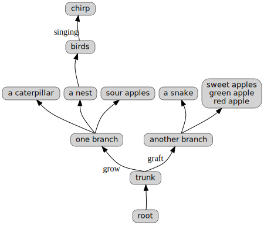
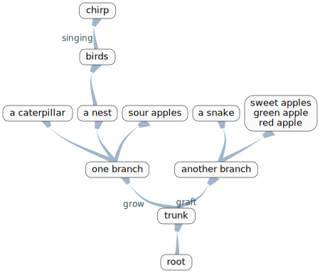
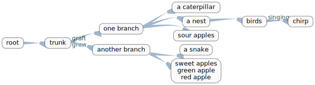

Python Mind Map
====================

Copyright (c) 2017-2018 Red Liu <lli_njupt@163.com>
Released under the MIT licence.

Python Mind Map based on Graphviz and yaml.

Yaml files are used to configure graph style and mind source file:

- styles/style.yaml is used to configure dot graph. You can changed it to fix your own mind map.
- sample/sample.yaml is a source file example.

Pymindmap is focused on create mindmap automatically with same style defined in styles/style.yaml.

The sample output svg looks like below:

With tapered.yaml style looks like:

With tapered.yaml style  and LR direction looks like:

You can convert svg file to other formation with command:

`$ convert  -colorspace RGB -density 200 -quality 50 sample.yaml.svg sample.jpg`

If you want to output Chinese characters or more beautiful mind map, maybe you need to install new fonts, with linux just put them into /usr/share/fonts/.

And you can create your own style yaml files under styles folder  as templates.

